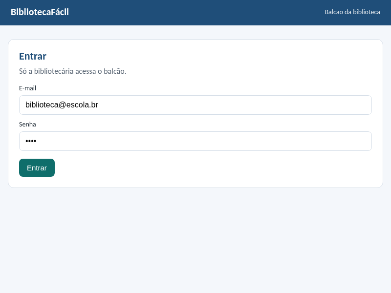
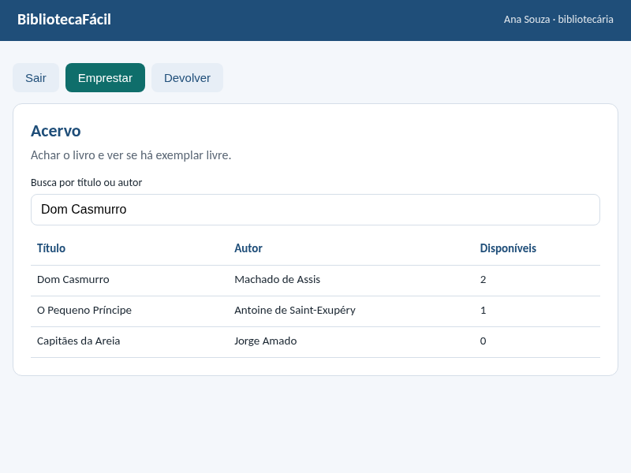
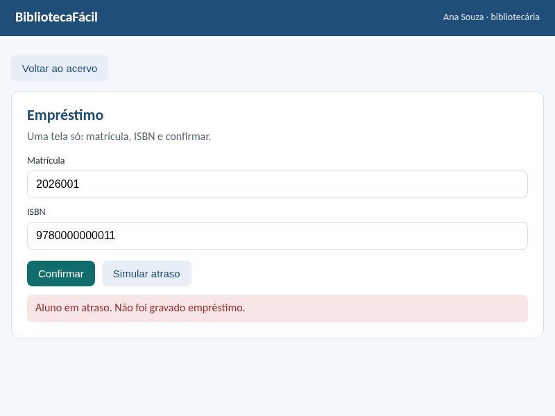
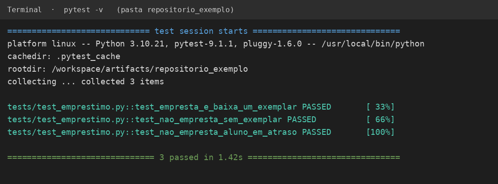

# BibliotecaFácil

Controle de empréstimo da biblioteca escolar. A bibliotecária entra no balcão, consulta o acervo, empresta um exemplar e recebe o prazo de 7 dias. Aluno em atraso ou livro sem estoque não gera empréstimo.

## Bibliotecas

| Nome | Versão | Uso |
|---|---|---|
| Python | 3.12 | Linguagem do projeto |
| Flask | 3.0.3 | Rotas e telas |
| Jinja2 | incluso no Flask 3.0.3 | HTML das telas |
| Bootstrap | 5.3.3 | Formulário no Chrome e no celular |
| pytest | 8.3.3 | Testes da regra |
| sqlite3 | incluso no Python | Gravação local |

Documentação oficial do Flask: https://flask.palletsprojects.com/

## Pastas

```text
biblioteca_facil/
├── README.md
├── requirements.txt
├── app/
│   ├── dominio/classes.py       abstração, herança, encapsulamento
│   ├── negocio/servico.py       regra de empréstimo e devolução
│   ├── persistencia/banco.py    SQLite, só grava e lê
│   └── interface/rotas.py       formulário e resposta da tela
├── templates/                   login, acervo, empréstimo, recibo
├── tests/test_emprestimo.py
└── docs/prints/                 telas e resultado do pytest
```

A interface não decide a regra. O serviço não escreve SQL. O banco não valida atraso.

## Como rodar

```bash
python -m venv venv
source venv/bin/activate
pip install -r requirements.txt
pytest -v
python app/interface/rotas.py
```

Abra http://127.0.0.1:5000

## Prints

Login:



Acervo:



Teste de aluno em atraso, sem gravar empréstimo:



Testes automáticos:



## POO neste projeto

- Encapsulamento: `disponiveis` e `matricula` ficam internos e saem por propriedade.
- Herança: `Aluno` e `Bibliotecaria` herdam `Pessoa`.
- Polimorfismo: `papel()` muda conforme a pessoa; `ValidadorEstoque` e `ValidadorAtraso` usam o mesmo `validar()`.
- Abstração: `Pessoa` e `Validador` não são instanciados; só as classes filhas.
